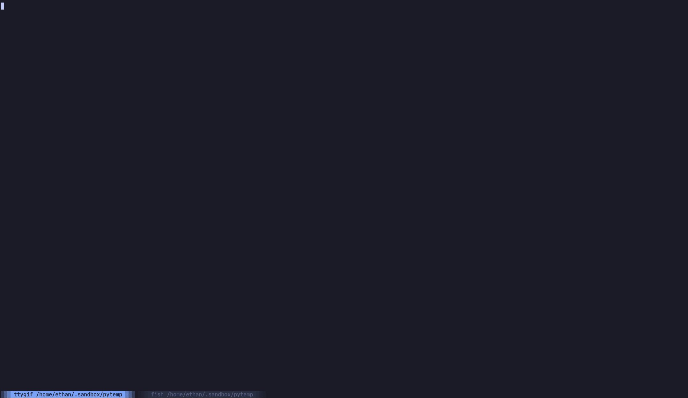

# VS Tasks

Telescope plugin to load and run tasks in a project that conform to VS Code's [Editor Tasks](https://code.visualstudio.com/docs/editor/tasks)

## Features

- ⚙ Run tasks with [Toggleterm](https://github.com/akinsho/nvim-toggleterm.lua)
    - run tasks in a horizontal or vertical split terminal
    - run launches in a horizontal or vertical split terminal
- ✏️  edit input variables that will be used for the session
- Use VS Code's [variables](https://code.visualstudio.com/docs/editor/variables-reference) in the command (limited support, see desired features)

## Example

Short Demo



## Setup and usage

With Plug:

```vim
Plug 'nvim-lua/popup.nvim'
Plug 'nvim-lua/plenary.nvim'
Plug 'nvim-telescope/telescope.nvim' " make sure you have telescope installed
Plug 'EthanJWright/vs-tasks.nvim'
```

With Packer:

```vim
use {
  'EthanJWright/vs-tasks.nvim',
  requires = {
    'nvim-lua/popup.nvim',
    'nvim-lua/plenary.nvim',
    'nvim-telescope/telescope.nvim'
  }
}
```

Set up keybindings:

```vim
" VStasks
nnoremap <Leader>ta :lua require("telescope").extensions.vstask.tasks()<CR>
nnoremap <Leader>ti :lua require("telescope").extensions.vstask.inputs()<CR>
nnoremap <Leader>tt :lua require("telescope").extensions.vstask.close()<CR>

" VSlaunches
nnoremap <Leader>la :lua require("telescope").extensions.vslaunch.launches()<CR>
nnoremap <Leader>li :lua require("telescope").extensions.vslaunch.inputs()<CR>
nnoremap <Leader>lt :lua require("telescope").extensions.vslaunch.close()<CR>
```
*Note:* When the task telescope is open:
  - Enter will open in toggleterm
  - Ctrl-v will open in a vertical split terminal
  - Ctrl-p will open in a split terminal

## Configuration

- Configure harpoon use (auto cache terminals based on task)
- Configure toggle term use
- Configure terminal behavior

```vim
lua <<EOF
-- VStasks
require("vstask").setup({
  use_harpoon = true, -- use harpoon to auto cache terminals
  telescope_keys = { -- change the telescope bindings used to launch tasks
      vertical = '<C-v>',
      split = '<C-p>',
      tab = '<C-t>',
      current = '<CR>',
  },
  terminal = 'toggleterm',
  term_opts = {
    vertical = {
      direction = "vertical",
      size = "80"
    },
    horizontal = {
      direction = "horizontal",
      size = "10"
    },
    current = {
      direction = "float",
    },
    tab = {
      direction = 'tab',
    }
  }
})

-- VSlaunches
require("vslaunch").setup({
  use_harpoon = false, -- use harpoon to auto cache terminals
  telescope_keys = { -- change the telescope bindings used to launch tasks
      vertical = '<C-v>',
      split = '<C-p>',
      tab = '<C-t>',
      current = '<CR>',
  },
  terminal = 'toggleterm',
  term_opts = {
    horizontal = {
      direction = "horizontal",
      size = "10"
    },
  }
})
EOF
```

## Example

### Tasks.json

In your project root set up `.vscode/tasks.json`

```json
{
  "version": "2.0.0",
  "tasks": [
  {
    "label": "🧪 Run unit tests that match the expression",
    "type": "shell",
    "command": "pytest -k '${input:expression}'"
  },
  {
    "label": "🐮 Cowsay",
    "type": "shell",
    "command": "echo ${input:cowmsg} | cowsay"
  }
  ],
  "inputs": [
  {
    "id": "expression",
    "description": "Expression to filter tests with",
    "default": "",
    "type": "promptString"
  },
  {
    "id": "cowmsg",
    "description": "Message for cow to say",
    "default": "Hello there!",
    "type": "promptString"
  }
  ]
}
```

### Launch.json

For launches set up `./vscode/launch.json`

```json
{
  "version": "0.2.0",
  "configurations": [
    {
      "name": "Say JOJO name",
      "request": "launch",
      "type": "shell",
      "program": "echo",
      "args": [
        "私は",
        "Giorno",
        "Giovanna"
      ]
    }
  ]
}
```

### Functions


```lua
lua require("telescope").extensions.vstask.tasks() -- open task list in telescope
lua require("telescope").extensions.vstask.inputs() -- open the input list, set new input
lua require("telescope").extensions.vstask.close() -- close the task runner (if toggleterm)
lua require("telescope").extensions.vslaunch.launches() -- open launch list in telescope
lua require("telescope").extensions.vslaunch.inputs() -- open the input list, set new input
lua require("telescope").extensions.vslaunch.close() -- close the launch runner (if toggleterm)
```

You can also configure themes and pass options to the picker

```lua
lua require("telescope").extensions.vstask.tasks(require('telescope.themes').get_dropdown()) -- open task list in telescope
```

## Features to implement

### Full VS Code variable support

All [variables available in VS Code](https://code.visualstudio.com/docs/editor/variables-reference) should also work in this plugin, though they are not all tested.

### Extend support for VS Code schema

At this point only the features I need professionally have been implemented.
The implemented schema elements are as follows:

- [x] Tasks: Args
- [x] Tasks: CWD
- [x] Tasks: Label
- [x] Tasks: Command
- [x] Tasks: ID
- [x] Inputs: Description
- [x] Inputs: Default
- [x] Launches: Args
- [x] Launches: CWD
- [x] Launches: Label
- [x] Launches: Command
- [x] Launches: ID


As I do not use VS Code, the current implementation are the elements that seem
most immediately useful. In the future it may be good to look into implementing
other schema elements such as problemMatcher and group.
